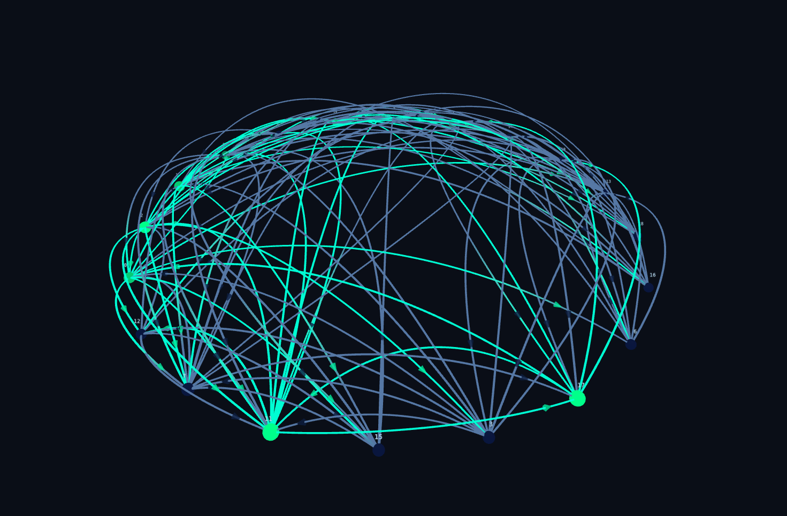

# Photon



A real-time network simulation inspired by genetic/boolean networks, with a 3D interactive visualization.

Nodes have activation states determined by random program rules (expression trees) evaluated over their inputs. The simulation runs as a synchronized cellular automaton with arbitrary connectivity graphs -- all state transitions are computed on the current state and applied simultaneously.

## Stack

- **Backend**: Clojure, http-kit (HTTP + WebSocket)
- **Frontend**: ClojureScript, shadow-cljs, Reagent, Three.js
- **Simulation**: Random expression tree rules, directed connectivity graphs

## Running

```bash
# Install dependencies
npm install

# Terminal 1: compile ClojureScript
npx shadow-cljs watch app

# Terminal 2: start server
clojure -M:run
```

Open http://localhost:8080/generate
